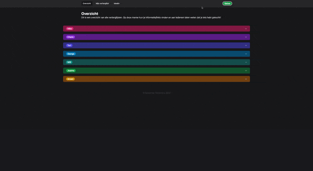

# christmas-gifts

A webapp to track Christmas gifts for my family and in-laws.

## Stack

-   Framework: [Nuxt 3](https://nuxt.com/)
-   Deployment: [Vercel](https://vercel.com)
-   Styling: [TailwindCSS](https://tailwindcss.com/)
-   Icons: [Phosphor Icons](https://phosphoricons.com/)
-   Database: [Supabase](https://supabase.com/)
-   ORM: [Prisma](https://prisma.io)

## Development

| Command      | Action                                      |
| :----------- | :------------------------------------------ |
| `yarn`       | Installs dependencies                       |
| `yarn dev`   | Starts local dev server at `localhost:3000` |
| `yarn build` | Builds production site to `./dist/`         |
