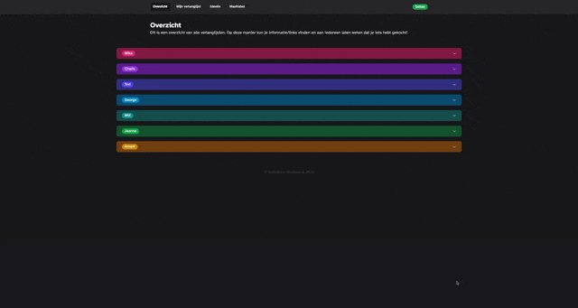

# christmas-gifts

A webapp to track Christmas gifts for my family and in-laws.

## Stack

-   Framework: [SvelteKit](https://kit.svelte.dev/)
-   Styling: [TailwindCSS](https://tailwindcss.com/)
-   Icons: [Iconify](https://iconify.com/)
-   Database: [Neon](https://neon.tech/)
-   ORM: [Drizzle](https://orm.drizzle.team/)

## Development

| Command       | Action                                      |
| :------------ | :------------------------------------------ |
| `bun install` | Installs dependencies                       |
| `bun dev`     | Starts local dev server at `localhost:5173` |
| `bun build`   | Builds production site                      |
